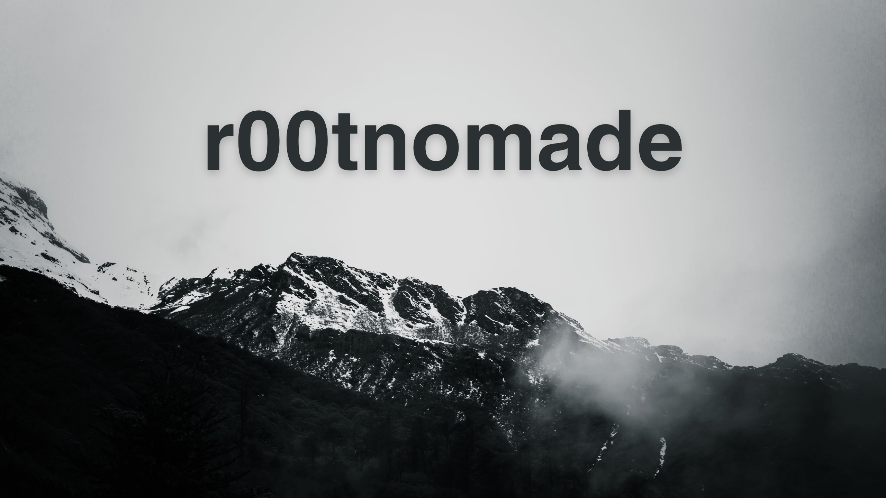

  

  
  &nbsp;
  

 

<h2 align="left">about me</h2>

<table align="center" border="0" cellpadding="10" cellspacing="0" width="100%">
  <tr>
    <td width="70%" valign="top">
      <b>Hey! I'm Sami</b>,
        
      a security student with an obsessive curiosity. I enjoy reading CVEs, breaking things apart to understand how they work, and building tools that actually do something useful. Right now I'm working on CloudSpill, a static IaC security scanner — my first serious project, built in public.
        
      <b>* Student, focused on security & low-level systems</b> 
      <b>* Interested in offensive security, cloud, and red teaming</b> 
      <b>* Vulnerability research & malware analysis on the side</b> 
      <b>* Always happy to help — feel free to reach out</b>
    </td>
    <td width="30%" valign="middle" align="center">
      
    </td>
  </tr>
</table>
 

<h2 align="center">languages</h2>

  
  
  
  
  
  
  
  

 

<h2 align="center">statistics</h2>

<table align="center" width="100%" border="0" cellpadding="5" cellspacing="0">
  <tr>
    <td width="50%" align="center">
      
    </td>
    

    

  </tr>
</table>

 

  

