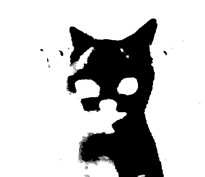

  

  &nbsp;

 

<h2 align="left">about me</h2>

<table align="center" border="0" cellpadding="10" cellspacing="0" width="100%">
  <tr>
    <td width="70%" valign="top">
      <b>Hey! I'm r00tnomade.</b>
        
      Security student and counter-surveillance enthusiast with a sharp eye for breaking systems and building robust defenses. I dive deep into CVEs, reverse-engineer complex targets, and develop practical offensive tools that deliver results.
        
      <b>* Specializing in red teaming, cloud security, and low-level systems</b> 
      <b>* Hands-on vulnerability research and malware analysis</b> 
      <b>* Passionate about counter-surveillance techniques and privacy</b> 
      <b>* Always open to meaningful conversations or collaborations — feel free to reach out.</b>
    </td>
    <td width="30%" valign="middle" align="center">
      
    </td>
  </tr>
</table>
 

<h2 align="center">languages</h2>

  &nbsp;&nbsp;&nbsp;&nbsp;
  &nbsp;&nbsp;&nbsp;&nbsp;
  &nbsp;&nbsp;&nbsp;&nbsp;
  &nbsp;&nbsp;&nbsp;&nbsp;
  &nbsp;&nbsp;&nbsp;&nbsp;
  &nbsp;&nbsp;&nbsp;&nbsp;
  

<h2 align="center">statistics</h2>

<table align="center" width="100%" border="0" cellpadding="5" cellspacing="0">
  <tr>
    <td width="50%" align="center">
      
    </td>
    

                <td width="50%" align="center">
      
    </td>
      
    

  </tr>
</table>

 

  

